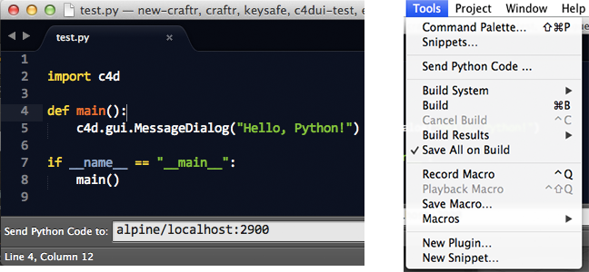

# Remote Code Runner - Cinema 4D & Sublime Text plugin

*Remote Code Runner* is a plugin for Cinema 4D and Sublime Text
that allows you to sent code from Sublime Text to Cinema 4D and execute
it like a script.



## Installation

1. Download the latest code from GitHub and unpack the content into
your Cinema 4D plugin directory.

    ```
    Cinema 4D RXX/
      plugins/
          remote-code-runner/
                remote_code_runner.pyp
                sublime-plugin/
                    RemoteCodeRunner/
                        ...
                ...
    ```

2. Copy (or symlink) the `RemoteCodeRunner` folder to your sublime
package directory. You can open this directory by heading to Sublime
"Preferences > Browse Packages ...".

3. Start Cinema 4D and run the "Tools > Send Python Code" command from
Sublime! The default settings should work fine.
